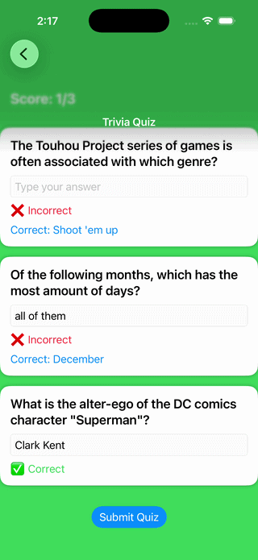

# Trivia Game App (Group Project)
## 📱 App Overview 

The Trivia Game App allows users to customize quiz settings such as difficulty, number of questions, and type. The app fetches questions dynamically and provides an interactive quiz experience with a final score display.

---

# 📋 App Specification

## User Features
- Select number of questions  
- Choose difficulty level  
- Choose question type  
- Answer quiz questions  
- View final score  

---

## Screens & Navigation

1. **Options Screen**
   - Select quiz settings  
   - Start quiz  

2. **Quiz Screen**
   - Display questions  
   - Answer input  
   - Timer (if implemented)  

3. **Results Screen**
   - Final score  
   - Restart option  

---

## 🖼️ Wireframes

### 📱 App Wireframe

### 📱 App Screenshot

   
## 🎥 App Demo Preview

